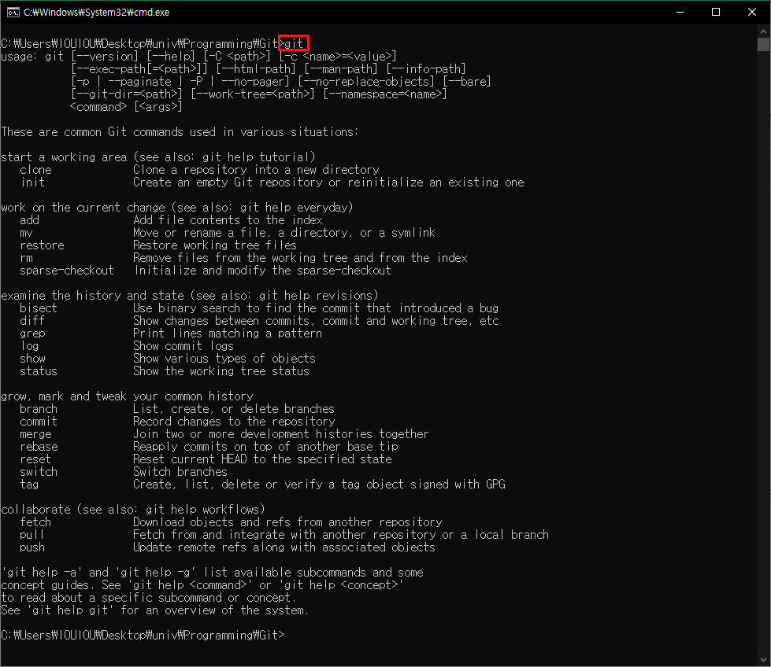
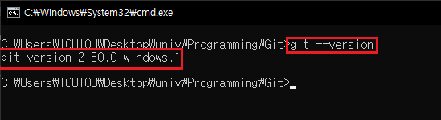

# Git Start

## Git 설치 & 명령어 확인하기

Git설치는 Git 홈페이지에서 간단하게 설치할 수 있다.  
설치중에 나타나는 다양한 옵션들은 별도로 지정할 필요 없이 `next` 를 눌러 계속 진행한다.   

기본적인 설치 후 CMD창을 열어 **git명령어** 를 입력해보면, 다양한 git 명령어를 확인할 수 있다.  

**입력**

<pre>
> git
</pre>

**실행결과**

</img>

간단하게 `git --version`명령어를 실행시켜 보자.

**입력**

<pre>
> git --version
</pre>

**실행결과**

</img>

